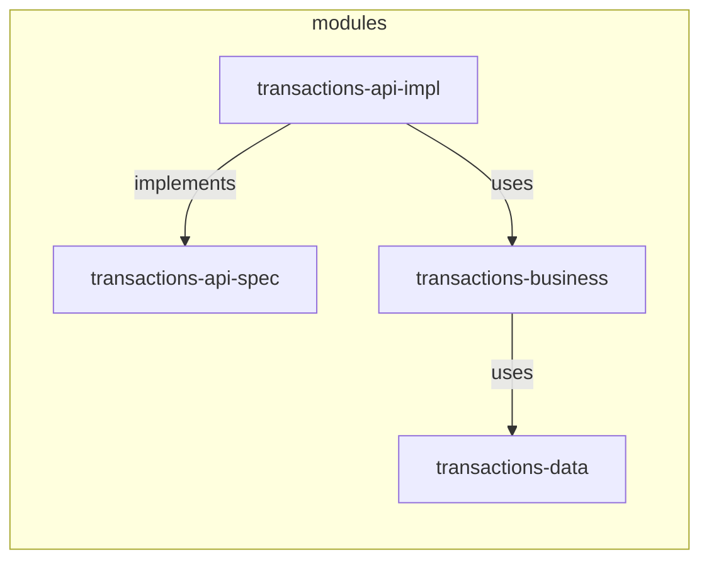

# transactions-api - Solution

Decisions taken and notes.

## What to build

### Design and implement a RESTful API

#### Modules

- **transactions-api-spec**: Contains the API definition for the service. Provides the HTTP interface.
- **transactions-api-impl**: Contains the API implementation for the service. 
This module will connect to `transactions-business` to execute the business logic.
- **transactions-business**: Contains the business logic for operations such as: 
transaction creation, transaction filtering and totalization. 
This module will connect to `transactions-data` to execute storage related operations.
- **transactions-data**: Contains the logic to store transactions data (in memory).
